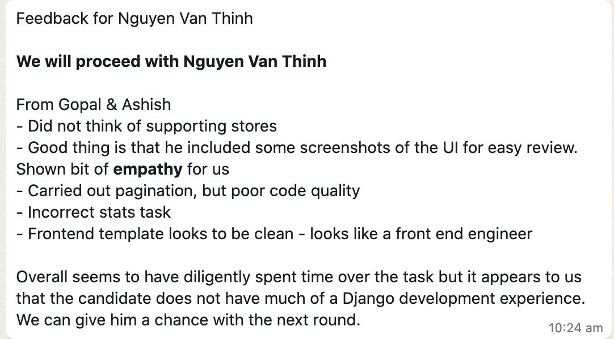

# Steps
1. Clone this repos
2. Create virtual enviroment(**venv**) and enable it.
3. install packages in requirements.txt, then go to konigle folder
4. 
run command **python manage runserver**     

run worker: **celery -A konigle worker -l info -P eventlet**     

run beat: **celery -A konigle beat -l info**      

admin page: admin/admin

   

## Task
Build a Django application with following functionalities
1. ~~Exposes an API to store the emails. Feel free to use Django REST Framework~~
2. ~~A view to list down the emails in the reverse chronological order and show the number of new emails added this calendar month~~. **run python manage runserver** and type 127.0.0.1 into browser.
3. ~~Integrate the api with the email collection widget present in this project.~~
4. ~~setup a celery task that runs every Monday and Wednesday and prints the number of new emails added in the current calendar month to the console.~~ . -> I use redis, celery to schedule tasks. 

 _NOTES_
 - ~~The widget itself sits on seller's online store (3rd party site) and sends data to your app (Konigle). The API is public but we don't want anyone to misuse it.~~ -> I use Throttling, you can see it in project setting file

 
 

# Feedback from Konigle

### Few question to ask interviewer
- Did not think of supporting store -> How will i solve this problem?
- How to refactor the code in pagination part to make it cleaner?
- How to do stats task correctly? (Origin task statement: Bonus - setup **a celery task** that runs every Monday and Wednesday and **prints** the number of new emails added in the current calendar month to the console.) Am I incorrect at set up schedule task or at the function that print out the task?
- **subscribed** and **unsubscribed** action - not really understand this information given in the statement.
